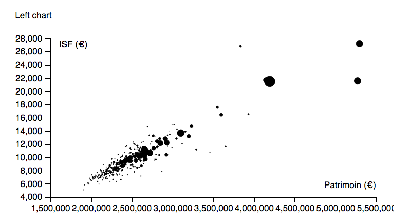
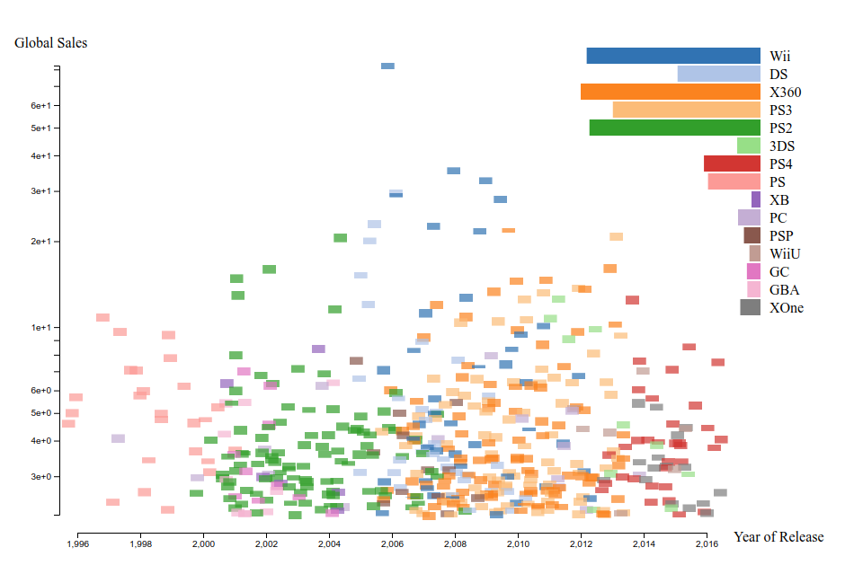
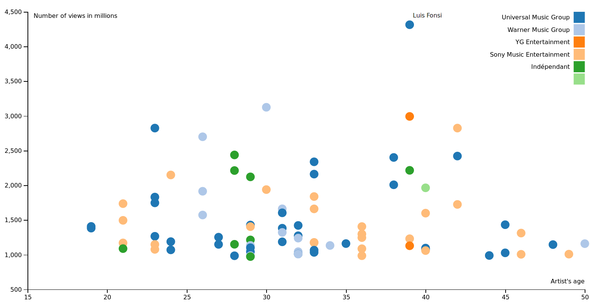

# Rendus projets étudiants ECL Disrupt'Campus

Projets réalisés pendant la formation en IA des étudiants de l'Ecole Centrale de Lyon en novembre 2017.

Enseignant: [Romain Vuillemot](http://romain.vuillemot.net/)

## Exoplanètes

**Cédric Ernewein**

Analyse de la position des exoplanètes découvertes par rapport à leur étoile

Lien: https://cernewein.github.io/project-data-viz-tgv/

  

## Étude de la répartition de l'ISF en France en 2015.

**Guillaume Lesaine**

Deux figures représentent l'ISF en France. La première est un scatterplot de l'ISF en fonction des revenus pour les différentes communes. La seconde est un barchart du nombre de redevables dans les différentes communes.

Lien: https://glesaine.github.io/projet-visu-isf2015/

  

## Star Visualization

**Yann Seiller**

Affichage de la déclinaison astronomique des étoiles en fonction de leur distance.

Lien: https://github.com/YannSeiller/Project_Star_visualization

  

## Video Game Top 500

**Adrien Cosson**

Visualisation des 500 jeux vidéos les plus vendus de l'histoire, classés par année de publication et plateforme de jeu.

Lien: https://adriencos.github.io/VideoGamesTop500/

  

## 

**Lévecque Clémence**

La base de données de travail répertorie les artistes avec le plus de vues sur Youtube (qui ont dépassé le milliard de vues au 15/11/17 ou qui vont le faire).
Cette visualisation montre la répartition de l'âge des chanteurs en fonction du nombre de vues, et rajoute le label auquel ils appartiennent. On peut découvrir le nom de l'artiste en passant dessus.

Lien : https://clemence-ecl.github.io/Visualization_most_viewed_artists/

  

## 

**Erwan Blain**

